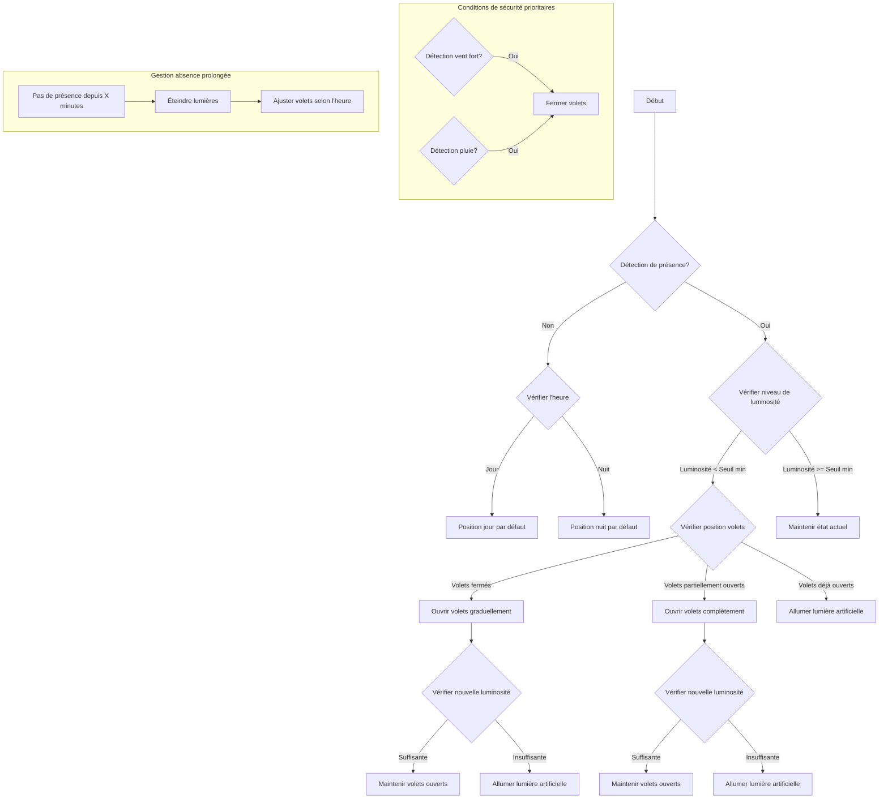

# Projet IoT

Ce projet est un système de gestion automatisé des volets roulants et de la lumière en fonction de
capteurs intelligents.

📌 Objectif du Projet
Développer un système intelligent qui ajuste automatiquement l’ouverture des volets
roulants et l’allumage des lumières d’une salle en fonction des conditions ambiantes et de la
présence humaine.

## materiel utilisé

- ESP32
- Capteur de luminosité
- Capteur de présence
- Servomoteur
- LED
- Résistance
- Breadboard
- Fils de connexion
- Alimentation 5V

## Schéma logique

## équipe

- [Jun](https://github.com/Juuunnne)
- [Vincent](https://github.com/Vincent-Altmann)
- [Alexandre](https://github.com/nnaova)
