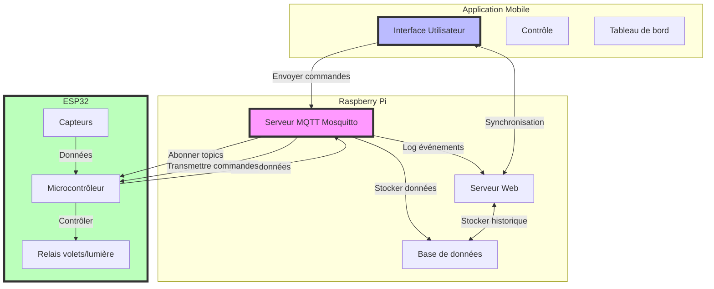
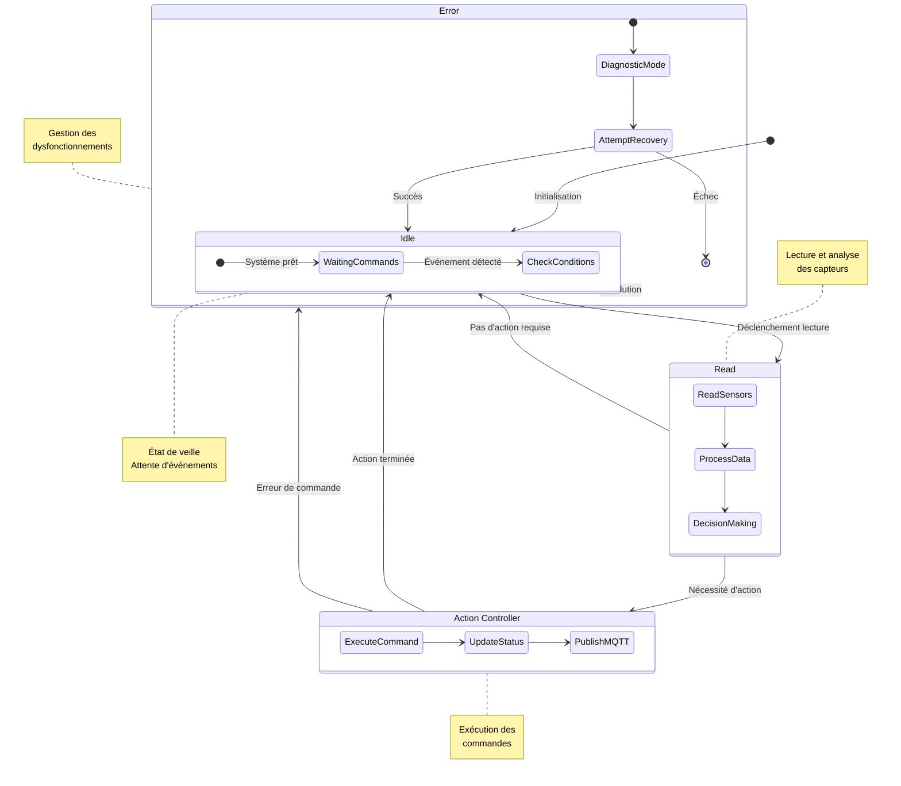

# Projet IoT

Ce projet est un système de gestion automatisé des volets roulants et de la lumière en fonction de
capteurs intelligents.

📌 Objectif du Projet
Développer un système intelligent qui ajuste automatiquement l’ouverture des volets
roulants et l’allumage des lumières d’une salle en fonction des conditions ambiantes et de la
présence humaine.

## materiel utilisé

- ESP32
- Capteur de luminosité
- Capteur de présence
- Servomoteur
- LED
- Résistance
- Breadboard
- Fils de connexion
- Alimentation 5V

## Schéma logique

```mermaid
stateDiagram-v2
    direction TB
    [*] --> InitState : Démarrage système
   
    state InitState {
        [*] --> ConnectWiFi : Connexion réseau
        ConnectWiFi --> ConnectMQTT : Connexion MQTT
        ConnectMQTT --> SystemInit : Initialisation
    }

    state SystemInit {
        [*] --> InitBlindsAuto : Mode Auto Volets
        [*] --> InitLightAuto : Mode Auto Lumière
    }
   
    state "Contrôle Volets" as BlindsControl {
        state "Mode Auto Volets" as BlindsAuto {
            CheckPresenceB --> CheckLuminosityB : Présence
            CheckLuminosityB --> AdjustBlinds : Seuil non atteint
            AdjustBlinds --> MaintainBlinds : Position OK
        }
        
        state "Mode Manuel Volets" as BlindsManual {
            WaitBlindCommands --> ExecuteBlindCommand
            ExecuteBlindCommand --> UpdateBlindStatus
        }
    }

    state "Contrôle Lumière" as LightControl {
        state "Mode Auto Lumière" as LightAuto {
            CheckPresenceL --> CheckLuminosityL : Présence
            CheckLuminosityL --> AdjustLight : Seuil non atteint
            AdjustLight --> MaintainLight : Niveau OK
        }
        
        state "Mode Manuel Lumière" as LightManual {
            WaitLightCommands --> ExecuteLightCommand
            ExecuteLightCommand --> UpdateLightStatus
        }
    }

    state PublishState {
        SendCurrentStatus
        SendSensorData
    }

    BlindsAuto --> BlindsManual : Commande manuelle volets
    BlindsManual --> BlindsAuto : Commande retour auto

    LightAuto --> LightManual : Commande manuelle lumière
    LightManual --> LightAuto : Commande retour auto

    BlindsControl --> PublishState : Mise à jour état
    LightControl --> PublishState : Mise à jour état
    PublishState --> BlindsControl : Nouvelle itération
    PublishState --> LightControl : Nouvelle itération

    note right of BlindsManual
        Mode exclusif:
        Seules les commandes
        manuelles sont acceptées
    end note

    note right of LightManual
        Mode exclusif:
        Seules les commandes
        manuelles sont acceptées
    end note

    note left of PublishState
        Publication MQTT:
        - États des dispositifs
        - Modes de fonctionnement
        - Données des capteurs
    end **note**
```

## Architecture



## Diagramme d'état



## équipe

- [Jun](https://github.com/Juuunnne)
- [Vincent](https://github.com/Vincent-Altmann)
- [Alexandre](https://github.com/nnaova)
